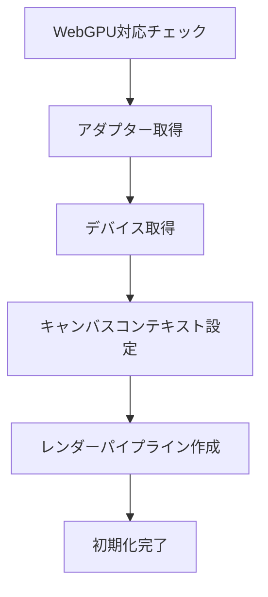

# アーキテクチャドキュメント

ikulab Motion Viewer Web Editionのコードベース構造と設計思想について説明します。

## 🏗 全体アーキテクチャ

### 設計思想

本プロジェクトは以下の原則に基づいて設計されています：

1. **モジュラー設計**: 各機能を独立したモジュールとして実装
2. **型安全性**: TypeScriptによる静的型チェックの活用
3. **パフォーマンス**: WebGPUによる高速3Dレンダリング
4. **保守性**: 明確な責任分離と文書化されたAPI
5. **拡張性**: 将来的な機能追加に対応できる柔軟な設計

### 技術スタック詳細

```
┌─────────────────────────────────────────┐
│                Frontend                 │
├─────────────────────────────────────────┤
│ React 18 + TypeScript                   │
│ Tailwind CSS + shadcn/ui                │
│ Lucide React (アイコン)                 │
├─────────────────────────────────────────┤
│                3D Engine                │
├─────────────────────────────────────────┤
│ WebGPU API                              │
│ WGSL シェーダー                         │
│ gl-matrix (数学ライブラリ)              │
├─────────────────────────────────────────┤
│               Build Tools               │
├─────────────────────────────────────────┤
│ Vite (モジュールバンドラー)             │
│ PostCSS + Autoprefixer                  │
│ TypeScript Compiler                     │
└─────────────────────────────────────────┘
```

## 📁 コンポーネント構造

### 1. Reactコンポーネント階層

```
App (メインアプリケーション)
├── WebGPUCanvas (3Dレンダリング)
├── ControlPanel (制御パネル)
│   ├── Card (WebGPU状態)
│   ├── Card (レンダリング制御)
│   ├── Card (デバッグ情報)
│   └── Card (未来機能)
└── StatusOverlay (ステータス表示)
```

### 2. コンポーネント責任

#### `App.tsx`
- **役割**: アプリケーション全体の状態管理とレイアウト
- **責任**:
  - WebGPU初期化状態の管理
  - レンダリング状態の制御
  - 子コンポーネント間の通信ハブ
- **状態**:
  ```typescript
  interface AppState {
    webgpuStatus: 'loading' | 'success' | 'error';
    webgpuError?: string;
    rendererInfo?: RendererInfo;
    status: StatusState;
    isRendering: boolean;
  }
  ```

#### `WebGPUCanvas.tsx`
- **役割**: WebGPUレンダリングエンジンとReactの橋渡し
- **責任**:
  - WebGPUレンダラーのライフサイクル管理
  - キャンバスのリサイズ処理
  - レンダリングループの制御
  - 親コンポーネントへの状態通知
- **主要メソッド**:
  ```typescript
  - initialize(): Promise<void>
  - startRendering(): void
  - stopRendering(): void
  - resizeCanvas(): void
  ```

#### `ControlPanel.tsx`
- **役割**: ユーザーインターフェース制御
- **責任**:
  - WebGPU状態の視覚的表示
  - レンダリング制御ボタン
  - デバッグ情報の表示
  - 未来機能のプレビュー

#### `StatusOverlay.tsx`
- **役割**: 一時的な状態メッセージの表示
- **責任**:
  - 成功/エラー/情報メッセージの表示
  - 自動非表示タイマー
  - アクセシブルな通知

## 🎮 WebGPUレンダリングエンジン

### `WebGPURenderer.ts`

#### 初期化フロー


#### 主要クラス構造
```typescript
class WebGPURenderer {
  private canvas: HTMLCanvasElement;
  private context: GPUCanvasContext;
  private device: GPUDevice;
  private adapter: GPUAdapter;
  private renderPipeline: GPURenderPipeline;
  
  async initialize(): Promise<boolean>
  render(): void
  resize(width: number, height: number): void
  getInfo(): RendererInfo
  destroy(): void
}
```

#### レンダリングパイプライン
1. **頂点シェーダー**: 三角形の頂点データを処理
2. **フラグメントシェーダー**: ピクセル色を決定
3. **コマンドエンコーダー**: GPUコマンドをエンコード
4. **レンダーパス**: 実際の描画処理
5. **コマンド送信**: GPUキューへの送信

### WGSL シェーダー詳細

#### 頂点シェーダー (`vs_main`)
```wgsl
@vertex
fn vs_main(@builtin(vertex_index) vertexIndex: u32) -> VertexOutput {
    // ハードコードされた三角形頂点
    var pos = array<vec2<f32>, 3>(
        vec2<f32>( 0.0,  0.5),  // 上
        vec2<f32>(-0.5, -0.5),  // 左下
        vec2<f32>( 0.5, -0.5)   // 右下
    );
    
    // 頂点ごとの色
    var color = array<vec3<f32>, 3>(
        vec3<f32>(1.0, 0.0, 0.0), // 赤
        vec3<f32>(0.0, 1.0, 0.0), // 緑
        vec3<f32>(0.0, 0.0, 1.0)  // 青
    );
}
```

#### フラグメントシェーダー (`fs_main`)
```wgsl
@fragment
fn fs_main(@location(0) color: vec3<f32>) -> @location(0) vec4<f32> {
    return vec4<f32>(color, 1.0); // アルファ値1.0で不透明
}
```

## 🎨 UI/UXアーキテクチャ

### shadcn/ui統合

#### コンポーネント設計原則
1. **再利用性**: 共通UIコンポーネントの標準化
2. **一貫性**: デザインシステムの統一
3. **アクセシビリティ**: ARIA準拠とキーボードナビゲーション
4. **カスタマイザビリティ**: Tailwind CSSによる柔軟なスタイリング

#### カラーシステム
```css
:root {
  --primary: 221.2 83.2% 53.3%;        /* ブルー系プライマリ */
  --secondary: 210 40% 96%;            /* ライトグレー */
  --destructive: 0 84.2% 60.2%;        /* 赤系エラー色 */
  --muted: 210 40% 96%;                /* ミュート色 */
  --accent: 210 40% 96%;               /* アクセント色 */
  --border: 214.3 31.8% 91.4%;         /* ボーダー色 */
}
```

### レスポンシブデザイン

#### ブレイクポイント戦略
```css
/* モバイル: 基本デザイン */
.canvas-container { @apply w-full h-full; }

/* タブレット: サイドパネル調整 */
@media (max-width: 768px) {
  .control-panel { @apply fixed right-[-320px]; }
}

/* デスクトップ: フル機能 */
@media (min-width: 1024px) {
  .control-panel { @apply w-80; }
}
```

## 🔄 状態管理パターン

### 状態フロー
```
User Action → App State → Component Props → UI Update
     ↑                                           ↓
Status Update ← WebGPU Renderer ← Canvas Event
```

### 状態管理戦略
1. **ローカル状態**: `useState`で各コンポーネント固有の状態
2. **プロップドリリング**: 親から子への状態受け渡し
3. **コールバック**: 子から親への状態更新通知
4. **カスタムフック**: 状態ロジックの再利用

## 🚀 パフォーマンス最適化

### レンダリング最適化
1. **React.memo**: 不要な再レンダリング防止
2. **useCallback**: 関数の再作成防止
3. **useMemo**: 高コストな計算のメモ化
4. **懐疑的更新**: アニメーションフレーム単位での更新

### WebGPU最適化
1. **コマンドバッファリング**: 効率的なGPUコマンド送信
2. **リソース管理**: メモリリークの防止
3. **シェーダー最適化**: 最小限の計算で最大の効果

## 🧪 テスト戦略

### テスト構造（将来実装予定）
```
tests/
├── unit/               # 単体テスト
│   ├── components/     # コンポーネントテスト
│   ├── webgpu/        # WebGPUロジックテスト
│   └── utils/         # ユーティリティテスト
├── integration/        # 統合テスト
├── e2e/               # エンドツーエンドテスト
└── visual/            # ビジュアルリグレッションテスト
```

## 📦 ビルドシステム

### Vite設定詳細
```typescript
export default defineConfig({
  plugins: [react()],
  resolve: {
    alias: { "@": path.resolve(__dirname, "./src") }
  },
  optimizeDeps: {
    include: ['gl-matrix', 'react', 'react-dom']
  }
});
```

### TypeScript設定
```json
{
  "compilerOptions": {
    "strict": true,
    "jsx": "react-jsx",
    "moduleResolution": "bundler",
    "baseUrl": ".",
    "paths": { "@/*": ["./src/*"] }
  }
}
```

## 🔮 拡張計画

### アーキテクチャ進化ロードマップ

#### Phase 1: 基盤強化
- ステートマネージャー導入（Zustand/Redux Toolkit）
- エラーバウンダリ実装
- ログシステム統合

#### Phase 2: 3D機能拡張
- カメラシステム（OrbitControls相当）
- ジオメトリライブラリ
- マテリアルシステム

#### Phase 3: BVH統合
- ファイルパーサーモジュール
- アニメーションエンジン
- タイムライン制御

#### Phase 4: 高度な機能
- シーン管理システム
- エクスポート機能
- パフォーマンスプロファイラー

## 🛡 セキュリティ考慮事項

1. **XSS対策**: React標準のエスケープ処理
2. **CSP**: Content Security Policy設定
3. **依存関係**: 定期的な脆弱性スキャン
4. **WebGPU**: サンドボックス化されたGPUアクセス

## 📚 参考資料

- [WebGPU仕様](https://www.w3.org/TR/webgpu/)
- [WGSL仕様](https://www.w3.org/TR/WGSL/)
- [React公式ドキュメント](https://react.dev/)
- [Tailwind CSS](https://tailwindcss.com/)
- [shadcn/ui](https://ui.shadcn.com/)

---

このドキュメントは実装の進行に合わせて継続的に更新されます。
